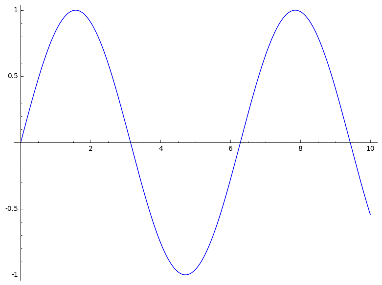

The rest of the lesson should be written as a normal RMarkdown file. You can
include chunk for codes, just like you'd normally do.

~~~
1 + 1
~~~
{: .source .python}

    2

Output with error message:

~~~
x[10]
~~~
{: .source .python}

~~~

    ---------------------------------------------------------------------------

    TypeError                                 Traceback (most recent call last)

    <ipython-input-2-084faa554d6d> in <module>()
    ----> 1 x[Integer(10)]
    

    TypeError: 'sage.symbolic.expression.Expression' object does not support indexing

~~~
{: .error}
Output generating figures:

~~~
plot(sin, (0,10))
~~~
{: .source .python}

For the challenges and their solutions, you need to pay attention to where the
`>` go and where to leave blank lines. You can include code chunks in both the
instructions and solutions. For instance this:

> ## Challenge: Can you do it?
>
> What is the output of this command?
>
> ~~~
> "a" + "b"
> ~~~
> {: .source}
>
> > ## Solution
> >
> > ~~~
> > ab
> > ~~~
> {: .solution}
{: .challenge}
